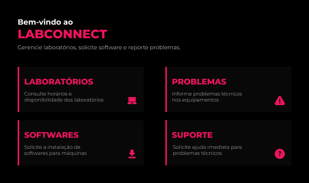

# LabConnect
> Aplicativo mobile de gerenciamento de laboratórios e suporte técnico para instituições de ensino.

<p align="center">
  
</p>

---

## Sobre o Projeto
O **LabConnect** é um aplicativo mobile desenvolvido em **React Native com Expo**, voltado para o ambiente acadêmico de uma faculdade de tecnologia. Ele centraliza em um único lugar a consulta de laboratórios, solicitação de instalação de softwares, reporte de problemas técnicos e chamada de suporte presencial.

### Qual problema ele resolve?

Em ambientes acadêmicos com múltiplos laboratórios e equipamentos, professores e técnicos frequentemente enfrentam dificuldades para:

- Saber quais laboratórios estão disponíveis e em quais horários;
- Solicitar a instalação de softwares específicos para uma turma;
- Reportar problemas técnicos nos equipamentos de forma ágil;
- Chamar suporte presencial sem precisar ligar ou se deslocar até a TI.

### Funcionalidades Implementadas

| Tela | Funcionalidade |
|---|---|
| **Home** | Menu principal com acesso às 4 seções do app |
| **Laboratórios** | Listagem de 4 labs com status de disponibilidade e agenda semanal completa |
| **Softwares** | Solicitação de instalação com formulário, listagem de pedidos e badges de status |
| **Problemas** | Reporte de problemas técnicos em equipamentos com histórico de chamados |
| **Suporte** | Chamada de técnico presencial diretamente para a sala do professor |

---

## Integrantes do Grupo

Projeto desenvolvido individualmente.

| Nome | RM |
|---|---|
| *Luana Magalhães Freire* | *565305* |

---

## Como Rodar o Projeto

### Pré-requisitos

Certifique-se de ter instalado na sua máquina:

- [Node.js](https://nodejs.org/) (versão 18 ou superior)
- [Expo CLI](https://docs.expo.dev/get-started/installation/)
- Aplicativo **Expo Go** no celular ([Android](https://play.google.com/store/apps/details?id=host.exp.exponent) / [iOS](https://apps.apple.com/app/expo-go/id982107779)) **ou** Android Studio com emulador configurado

### Passo a Passo

**1. Clone o repositório**
```bash
git clone https://github.com/Iuanamagalhaes/fiap-cpad-cp1-app-labconnect
cd labconnect
```

**2. Instale as dependências**
```bash
npm install
```

**3. Inicie o projeto**
```bash
npx expo start
```

**4. Rode no dispositivo**

- **Celular físico:** Abra o Expo Go e escaneie o QR Code exibido no terminal.
- **Emulador Android:** Pressione `a` no terminal após o Expo iniciar.

---

## Demonstração

### Vídeo do App em Funcionamento

<p align="center">
  
</p>

---

## Decisões Técnicas

### Estrutura do Projeto

```
labconnect/
├── app/
│   ├── _layout.js       # Configuração do Stack Navigator (expo-router)
│   ├── index.js         # Tela inicial (Home)
│   ├── laboratorios.js  # Tela de laboratórios e agenda
│   ├── softwares.js     # Tela de solicitação de softwares
│   ├── problemas.js     # Tela de reporte de problemas
│   └── suporte.js       # Tela de suporte / chamada na sala
├── assets/              # Ícones e imagens do app
└── package.json
```

### Hooks Utilizados

| Hook | Onde foi usado | Para quê |
|---|---|---|
| `useState` | Todas as telas | Controle de estado local: formulários, listas de dados, visibilidade de toasts e seleções do usuário |
| `useRouter` | Todas as telas | Navegação entre telas (`router.push()` para avançar, `router.back()` para voltar) |

### Como a Navegação foi Organizada

A navegação foi construída com **expo-router** em modo `Stack`, configurado no `_layout.js` com `headerShown: false` para que cada tela gerencie seu próprio cabeçalho visualmente.

- A **Home** (`index.js`) é o ponto de entrada e usa `router.push('/nome-da-tela')` para navegar para cada seção.
- Cada tela interna tem um botão "Voltar" estilizado que chama `router.back()`, retornando à Home.
- O fluxo de navegação é linear: **Home → Tela → Home**.

---

## Próximos Passos

Com mais tempo de desenvolvimento, as seguintes melhorias seriam implementadas:

- **Autenticação de usuário** — login diferenciado para professor, aluno e técnico, com permissões distintas por perfil.
- **Filtros na agenda** — busca por laboratório, dia da semana ou disciplina na tela de Laboratórios.
